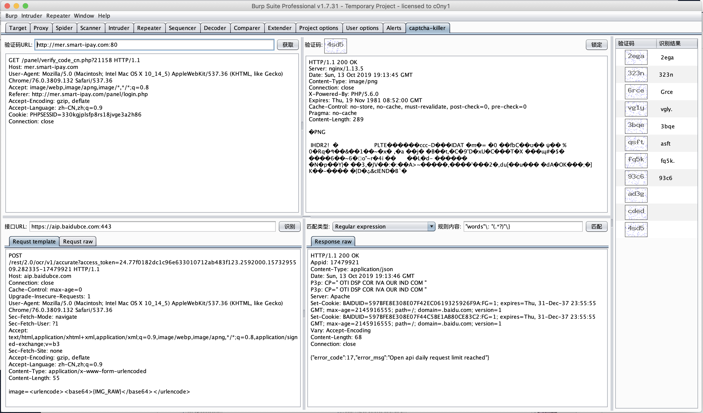

# captcha-killer | burp验证码识别接口调用插件
## 0x01 插件简介
`captcha-killer`要解决的是让burp能用上各种验证码识别技术！

**注意：`captcha-killer`本身无法识别验证码，它专注于对各种验证码识别接口的调用。任何识别技术，只需要开放web调用api接口就可以通过
`captcha-killer`来调用。**

## 0x02 使用步骤

#### 1.将获取验证码的数据包发送到插件
注意：获取验证码的cookie一定要和intruder发送的cookie相同！
#### 2. 配置识别验证码的接口调用数据包，并设置匹配结果的正则表达式
`{IMG_RAW}`
`<url-encode></url-encode>`
`<base64></base64>`

#### 3. 在intruder中调用

更多案例可以访问[《使用captcha-killer插件对抗图片验证码》](http://gv7.me)

## 0x03 同类项目
* [reCAPTCHA](https://github.com/bit4woo/reCAPTCHA)
* [实现一个简单的Burp验证码本地识别插件](https://www.freebuf.com/articles/web/168679.html)
* https://github.com/Releasel0ck/reCAPTCHA