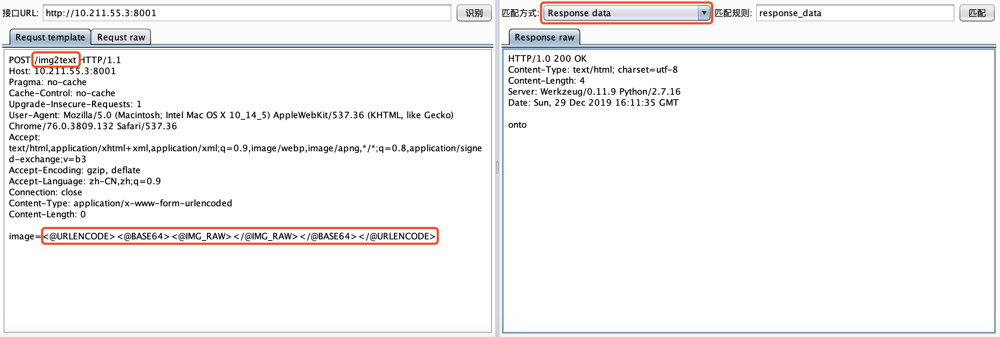

# captcha-killer调用tesseract-ocr识别验证码
## 0x01 思路
整体的识别流程是通过python启动一个web服务器开放一个接口来接收captcha-killer传来的验证码图片内容，然后调用tesseract来识别，最后返回结果给captcha-killer。

## 0x02 环境搭建

#### 2.1 安装并配置tesseract
去如下地址下载tesseract相关的程序

开源地址：https://github.com/tesseract-ocr/
下载地址：http://digi.bib.uni-mannheim.de/tesseract/tesseract-ocr-setup-4.00.00dev.exe


安装成功后需要配置两个环境变量，变量值请根据自己的情况修改。

|环境变量|变量值|
|:---|:---|
|Path|D:\software\Tesseract-OCR|
|TESSDATA_PREFIX|D:\software\Tesseract-OCR\tessdata|


#### 2.2 安装依赖的python库

```
pip install Pillow
pip install pytesseract
pip install flask
```

## 0x03 编写验证码识别接口

我们先来写个python调用`tesseract`识别验证码的小demo

```python
#coding: utf-8
import sys
import pytesseract
from PIL import Image
image = Image.open(sys.argv[1])
vcode = pytesseract.image_to_string(image)
print (vcode)
```

注意: 在windows下，你的`python`项目需要和`tesseract`安装目录在同一个盘符下，不然会报错。

为了让`captcha-killer`插件能调用到demo中的代码，我们需要为其提供web接口。将会在8001端口上开放一个web服务，调用者只需要将图片base64编码后的数据通过image参数post提交到`/img2text`即可返回识别结果,具体实现的代码如下：

```python
#coding: utf-8
import os
import sys
import base64
import time
import pytesseract
from PIL import Image
from flask import Flask
from flask import request
app = Flask(__name__)

@app.route('/')
def hello_world():
    return 'post image=<@URLENCODE><@BASE64><@IMG_RAW></@IMG_RAW></@BASE64></@URLENCODE> to /img2text'
    
@app.route('/img2text', methods=['post'])
def img2text():
    '''
    接受接口调用者传来的图片内容
    '''
    base64_img = request.form['image']
    if base64_img:
        img_name = save2img(base64_img)
        return identify_img(img_name)
    else:
        return 'img is null'

    
def save2img(base64_img):
    '''
    将图片数据base64解码保存为文件
    '''
    bin_img = base64.b64decode(base64_img)
    img_name = '%s.png' % time.strftime('%Y%m%d%H%M%S',time.localtime(time.time()))
    print img_name
    f = open(img_name,'wb')
    f.write(bin_img)
    f.close()
    return img_name
    
def identify_img(img_name):
    '''
    调用tesseract识别图片
    '''
    image = Image.open(img_name)
    vcode = pytesseract.image_to_string(image)
    #os.remove(img_name)
    vcode = vcode.replace(' ','')
    return vcode
        
if __name__ == '__main__':
    # app.debug = True
    app.run(threaded=True, port=8001,host='0.0.0.0')
```

## 0x04 配置captcha-killer

根据如上接口调用规则，我们可以配置captcha-killer模版如下：

```
POST /img2text HTTP/1.1
Host: 10.211.55.3:8001
Pragma: no-cache
Cache-Control: no-cache
Upgrade-Insecure-Requests: 1
User-Agent: Mozilla/5.0 (Macintosh; Intel Mac OS X 10_14_5) AppleWebKit/537.36 (KHTML, like Gecko) Chrome/76.0.3809.132 Safari/537.36
Accept: text/html,application/xhtml+xml,application/xml;q=0.9,image/webp,image/apng,*/*;q=0.8,application/signed-exchange;v=b3
Accept-Encoding: gzip, deflate
Accept-Language: zh-CN,zh;q=0.9
Connection: close
Content-Type: application/x-www-form-urlencoded
Content-Length: 0

image=<@URLENCODE><@BASE64><@IMG_RAW></@IMG_RAW></@BASE64></@URLENCODE>
```

而返回包的包体内容就是验证码，故直接选择匹配方式为`Response data`



将接口服务启动并配置好模版，爆破效果如下：


## 0x05 总结
由于我只是简单的调用了tesseract的代码，没有对图片进行任何处理。所以识别效果很一般。大家可以对图片进行二值化等处理，或者自己训练下tesseract的识别库，效果会更好。